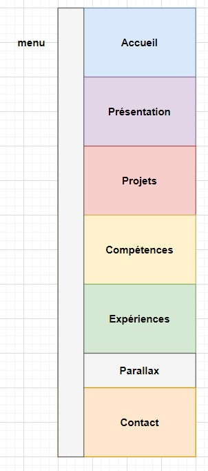
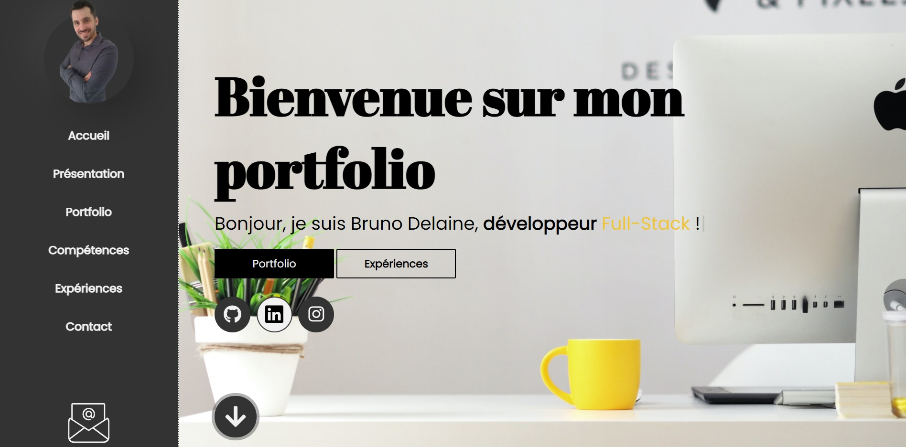
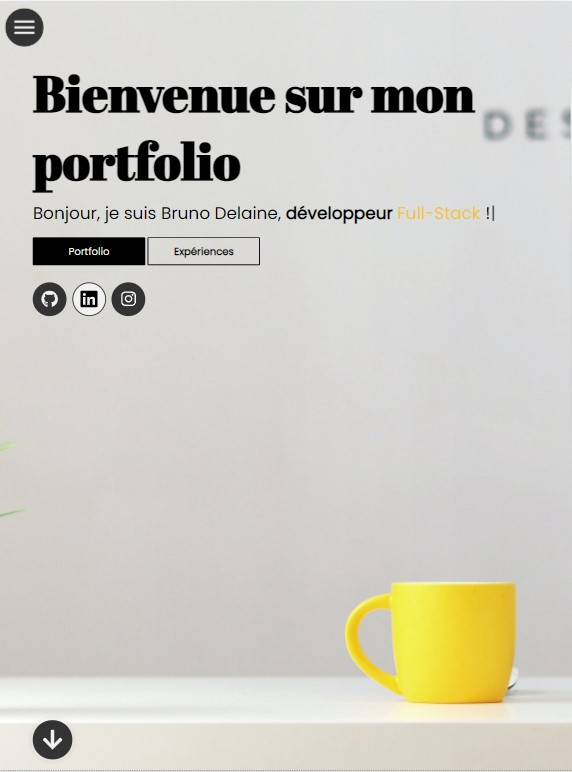
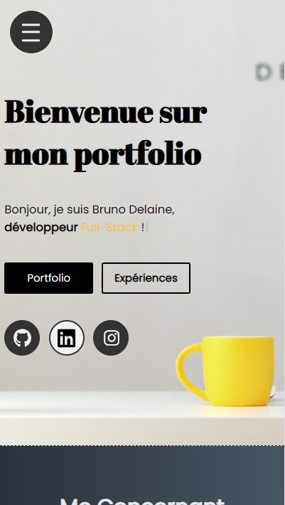
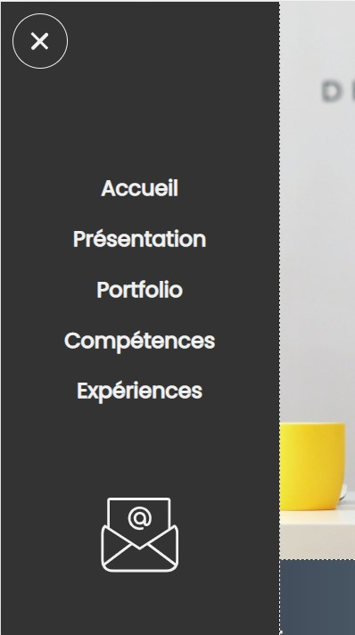
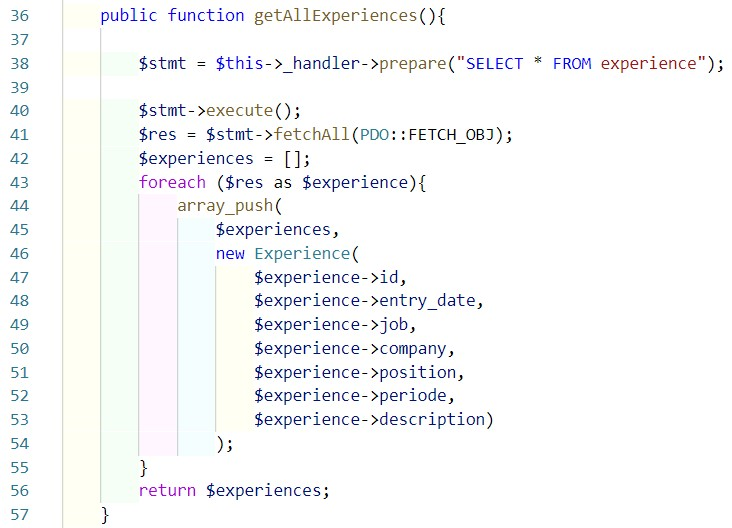
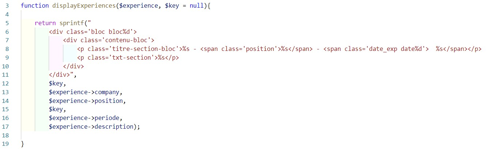
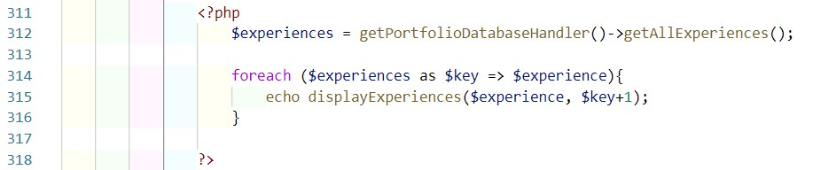

# Mon portfolio

* ##  Introduction
* ##  Spécifications techniques du projet
* ##  Extraits de code

## Introduction :

### Dans le cadre de ma reconversion professionnelle et suite à l'obtention de titre RNCP de niveau 3 (BAC+2) j'ai mis en place en toute logique mon portfolio, présentant un peu de moi, de mon parcours et de mes projets, laissant la possibilité de me contacter depuis le site. J'ai pour ce faire pris le temps de consulter une formation udemy traitant du sujet et pris les devants des améliorations nécessaires comme la logique d'exécution du projet, l'utilisation de PHP pour le back-end, l'intégration de modales codées en HTML, JS et CSS ou encore la sécurisation via PHP du formulaire de contact.

## Spécifications techniques du projet :

* ###  arborescence :

### Le projet est découpé en 7 sections, un menu fixé sur la gauche permet d'accéder à 6 d'entre elles, la 7ème étant un parallax intégrant un proverbe.

* ###  Front-end :
### HTML pour structurer et mettre en forme le projet, l'utilisation des attributs, combinée au Javascript m'a permis la création de modales.
### Javascript m'a permis d'intervenir dans le dynamisme de la page, avec par exemple la présence d'un menu fixe qui laisse place à un bouton toggle en dessous d'une largueur d'écran de 1300px. L'utilisation de ses bibliothèques TypeWritter, ScrollMagic ou encore GreenSock a permis les différentes animations.
### CSS : L'utilsation du CSS m'a évidemment permis de styliser mes pages mais aussi de créer une adaptabilité à tous les écrans.

  * Vue écran large

  * Vue iPad Pro

   * Vue iPhone 5/SE

   * Menu iPhone 5/SE

* ###  Back-end :
### Mariadb comme gestionnaire de base de données. cette BDD est composée 5 tables.
### PHP, par son utilisation mettre en place la logique d'exécution du projet. Une classe databaseHandler me permet d'y implémenter toutes mes méthodes renfermant mes CRUD (PDO et requètes préparées). Les données récupérées sont ainsi converties en objets manipulables PHP et sont utilisés en paramètre de fonction propre à leur affichage. Cette convertion peut se faire par la mise en place de modèles (classes) PHP reflétant chacune d'entre elle une table de la base de données relationnelle.
### Ce langage me permet également l'implémentation d'un captcha, à partir de fonctions PHP, sur le formulaire, sa validation et l'envoi du mail par la fonction mail().

##  Extraits de code :

* ### Back :

### Exemple de la logique d'exécution pour l'affichage de la section expérience.

 * La méthode de la classe databaseHandler va récupérer les données en bdd et les convertir et retourner en tableau d'objets Expérience

 * La fonction d'affichage d'un objet Experience va prendre un paramètre

 * Un foreach va ensuite permettre pour chaque objet Expérience du tableau récupéré, d'appeler la fonction d'affichage
 
